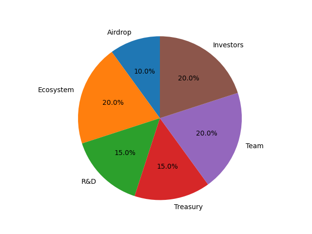
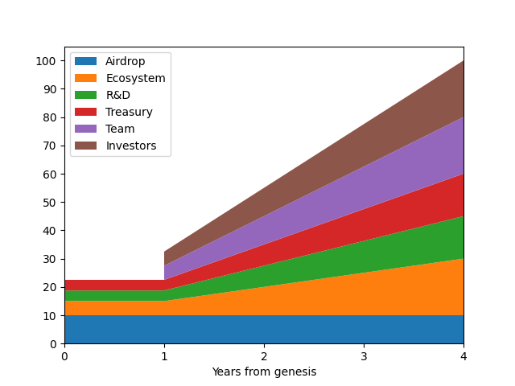

# Distribution

### Genesis Distribution

<figure><figcaption></figcaption></figure>

<table data-full-width="true"><thead><tr><th width="149">Category</th><th width="800">Description</th><th>%</th></tr></thead><tbody><tr><td>Airdrop</td><td>Participants of incentivised testnet campaigns</td><td>10%</td></tr><tr><td>R&#x26;D</td><td>Allocated to Fractal Foundation to support protocol development and R&#x26;D</td><td>15%</td></tr><tr><td>Investors</td><td>Investors that provided funding and support</td><td>20%</td></tr><tr><td>Treasury</td><td>Allocated to the treasury and managed via on-chain governance to further the Fractal network</td><td>15%</td></tr><tr><td>Ecosystem  &#x26; Community</td><td>Allocated to incentivise a rich ecosystem and community</td><td>20%</td></tr><tr><td>Team</td><td>Reserved for past and future core contributions</td><td>20%</td></tr></tbody></table>

### Token Vesting

<figure><figcaption></figcaption></figure>

<table><thead><tr><th width="152">Category</th><th>Vesting Schedule</th></tr></thead><tbody><tr><td>Airdrop</td><td>Unlocked at genesis</td></tr><tr><td>R&#x26;D</td><td>25% unlocked at genesis, 75% linear vesting from year 1 - 4</td></tr><tr><td>Investors</td><td>12 month lockup, 25% unlock after 12 months, 75% linear vesting from year 1 - 4</td></tr><tr><td>Treasury</td><td>25% unlocked at genesis, 75% linear vesting from year 1 - 4</td></tr><tr><td>Ecosystem  &#x26; Community</td><td>25% unlocked at genesis, 75% linear vesting from year 1 - 4</td></tr><tr><td>Team</td><td>12 month lockup, 25% unlock after 12 months, 75% linear vesting from year 1 - 4</td></tr></tbody></table>
